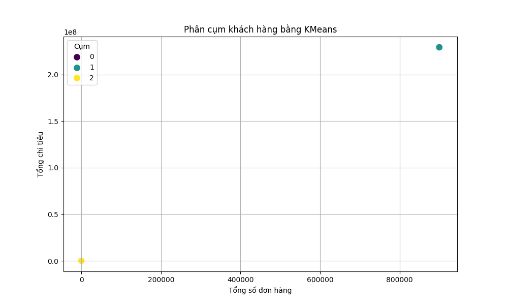

<h2>I. Sinh dữ liệu cá nhân hóa</h2>

Output: transactions_1721031591.csv

<h2>II. Tiền xử lý dữ liệu </h2>

Output: bad_rows_1721031591.csv và processed_data_1721031591.csv

<h2>III. Phân tích dữ liệu </h2>

Output: weekly_spending_1721031591.csv, customer_segmentation_1721031591.csv, declining_customers_1721031591.csv

<h2>IV. Phát hiện giao dịch bất thường</h2>

Output: suspect_transactions_1721031591.csv

<h2>V. Tùy chọn nâng cao</h2>

Output: customer_clusters_bonus_1721031591.png

